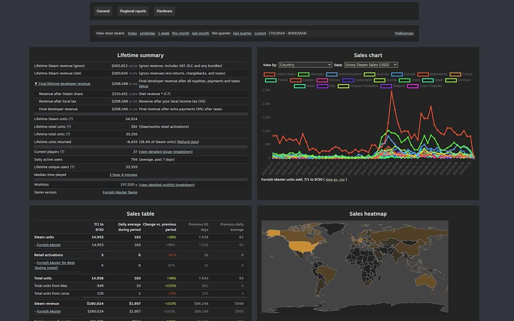

# Steamworks extras
[![GitHub Release][github_release_badge]][github_release_link]
[![GitHub License][github_license_badge]][github_license_link]
[![DeepWiki][deepwiki_badge]][deepwiki_link]

[![][chrome_ext_badge]][chrome_ext_link]
[![][chrome_store_rating_badge]][chrome_ext_link]
[![][chrome_store_users_badge]][chrome_ext_link]

**This extension shows additional information about your games in Steamworks report pages.**

[How to install](https://github.com/Flakky/steamworks-extras/wiki/How-to-install) | [Discord](https://discord.gg/zmpUPnP4BM) | [FAQ](https://github.com/Flakky/steamworks-extras/wiki/FAQ) | [Report an issue](https://github.com/Flakky/steamworks-extras/issues)

## Features
- Improved sales chart with different data types and view categories
- Enhanced wishlists chart with splits by countries and regions, including an extra table with regional wishlist information
- Reviews chart, along with a table of reviews divided by language
- Enhanced traffic chart with the ability to see any categories by impressions, visits, and even click-through rate
- Lifetime developer revenue calculation
- Full revenue flow visualization with configurable taxes and royalties
- Final revenue calculation for the current date range
- Improved layout for sales and wishlist report pages

> [!NOTE]
> The extension collects information about your game and stores it locally. The extension does not send your data anywhere outside your browser.

## Install

### Chrome store
Go to the Chrome extensions store and simply install it.

https://chromewebstore.google.com/detail/steamworks-extra-reports/cdobnjfogldjaihapojppnopiaccgpag

### Developer mode

1. Clone the repository or simply download it as a zip archive and extract it to some folder.
2. Go to `chrome://extensions/`
3. Enable Developer Mode
4. Use "Load unpacked" and select directory wich contains `manifest.json` file.

## Setup

The extension has an options page where you can set up all the revenue shares and taxes. To open settings, activate the plugin, find its icon on your browser toolbar, press the right mouse button and select "Options". Another way to find the settings page is simply by going to your app details page and pressing the "Setup" button near the final revenue display.

<!-- Links for readme -->

[github_license_badge]: https://img.shields.io/github/license/Flakky/steamworks-dev-chrome-ext
[github_license_link]: https://github.com/Flakky/steamworks-dev-chrome-ext/blob/main/LICENSE

[github_release_badge]: https://img.shields.io/github/v/release/Flakky/steamworks-dev-chrome-ext
[github_release_link]: https://github.com/Flakky/steamworks-dev-chrome-ext/releases

[chrome_ext_badge]: https://img.shields.io/badge/Chrome_Extension-test
[chrome_ext_link]: https://chromewebstore.google.com/detail/steamworks-extra-reports/cdobnjfogldjaihapojppnopiaccgpag

[chrome_store_rating_badge]: https://img.shields.io/chrome-web-store/rating/cdobnjfogldjaihapojppnopiaccgpag
[chrome_store_users_badge]: https://img.shields.io/chrome-web-store/users/cdobnjfogldjaihapojppnopiaccgpag

[deepwiki_badge]: https://deepwiki.com/badge.svg
[deepwiki_link]: [https://deepwiki.com/badge.svg](https://deepwiki.com/Flakky/steamworks-extras)

